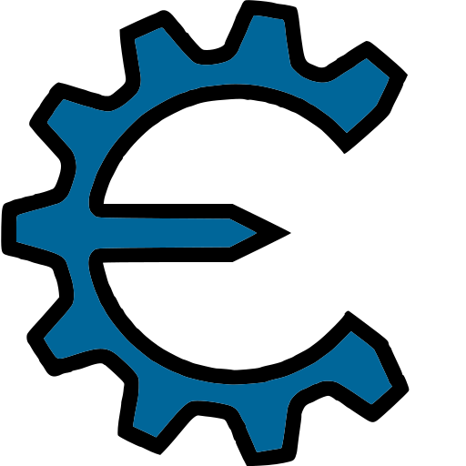
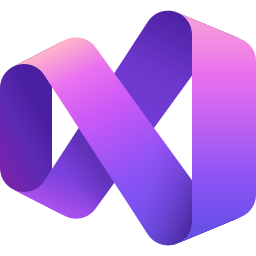

<!-- 🔹 TOP BANNER IMAGE -->

<!-- 🔹 BADGES SECTION -->

<!-- 🔹 LIVE STATUS BADGES -->

<!-- 🔹 DEPLOYMENT STATUS -->

<!-- 🔹 INTRO SECTION -->

Hey! 👋 I’m <b>Prince</b>, also known as <b>0xPrince</b>, a coder from India driven by  
<b>Core Innovation</b>, <b>System Security</b>, and <b>Engineering Excellence</b>.  
I love diving into complex algorithms and transforming ideas into  
<b>impactful real-world solutions</b>.  
Off the keyboard, I’m vibing to music or immersed in cinematography 🎬

<!-- 🔹 METRICS IMAGE -->

<!-- 🔹 GITHUB STREAK STATS -->

    

<!-- 🔹 TOOLBOX TITLE IMAGE -->

<!-- 🔹 MAIN TECH STACK -->

<!-- Frameworks & ML -->

<!-- Languages -->

<!-- Web -->

<!-- Data Science -->

<!-- Databases -->

<!-- BI Tools -->

<!-- Dev Tools -->

<!-- Extras -->

 

<!-- 🔥 BUILDING TOOLS (ONE LINE ONLY) -->

<!-- IDE & Automation Tools + Reverse Engineering -->

<!-- 🔹 ANIMATION DIVIDER -->

<!-- 🔹 CONNECT  -->

<!-- 🔹 INT SECTION -->

<b><i>Deeply passionate</i></b> about building  
<i><b>innovative, secure, and impactful systems</b></i>.  
If you want to collaborate on something <b>meaningful</b>,  
let’s create something <b>extraordinary</b> 🚀

<!-- 🔹 SOCIAL LINKS -->

<!-- 🔹 FOOTER -->

Made with 💌 by <b>0xPrince</b>  
<i>Last updated: March 2026 - v1.0</i>

<!-- 🔹 FOOTER WAVE -->

